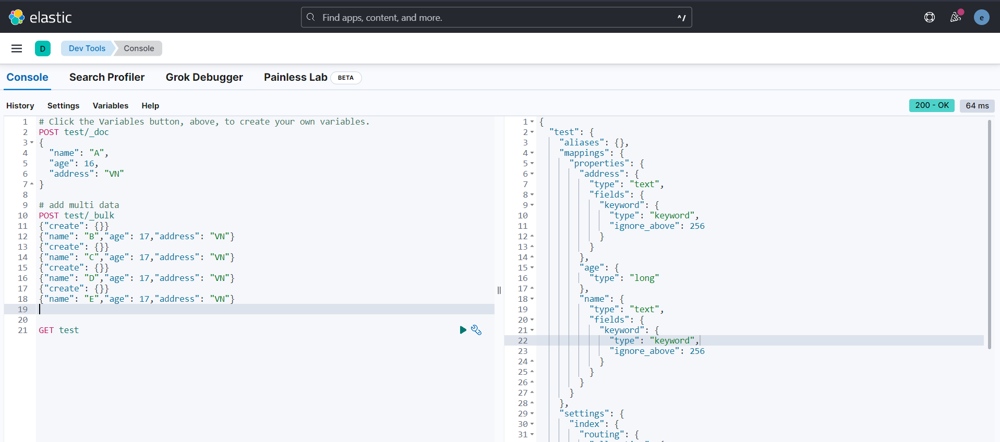

# Install Elasticsearch and Kibana by Docker

This guide provides step-by-step instructions to install Elasticsearch and Kibana using Docker containers.

## Prerequisites

Before you begin, make sure you have the following prerequisites:

-   Docker installed on your machine. If you don't have Docker installed, you can follow the official Docker installation guide for your operating system.

## Step 1: Create Docker Network

1. Open your terminal or command prompt.

2. Run the following command to create a Docker network:

```bash
docker network create elk-network
```

## Step 2: Pull Elasticsearch Docker Image

1. Open your terminal or command prompt.

2. Run the following command to pull the Elasticsearch Docker image:

```bash
docker pull docker.elastic.co/elasticsearch/elasticsearch:8.8.1
```

## Step 3: Run Elasticsearch Container

Run the following command to start an Elasticsearch container:

```bash
docker run --name elasticsearch --net elk-network -p 9200:9200 -p 9300:9300 -e "discovery.type=single-node" -it docker.elastic.co/elasticsearch/elasticsearch:8.8.1
```

Wait for Elasticsearch to start. You can check the container logs using the following command:

```bash
docker logs -f elasticsearch
```

Once Elasticsearch has started, you should see log messages indicating that the service is running.

## Step 4: Pull Kibana Docker Image

Open another terminal or command prompt.

Run the following command to pull the Kibana Docker image:

```bash
docker pull docker.elastic.co/kibana/kibana:8.8.1
```

## Step 5: Run Kibana Container

Run the following command to start a Kibana container:

```bash
docker run -d --name kibana --net elk-network -p 5601:5601 docker.elastic.co/kibana/kibana:8.8.1
```

Wait for Kibana to start. You can check the container logs using the following command:

```bash
docker logs -f kibana
```

Once Kibana has started, you should see log messages indicating that the service is running.

## Step 6: Access Elasticsearch and Kibana

Elasticsearch can be accessed at http://localhost:9200.

Kibana can be accessed at http://localhost:5601.

Result:


Example of Elasticsearch:



For more information and advanced configurations, please refer to the official documentation:

Elasticsearch documentation: [Here](https://www.elastic.co/guide/en/elasticsearch/reference/current/index.html)

Kibana documentation: [Here](https://www.elastic.co/guide/en/kibana/current/index.html)
